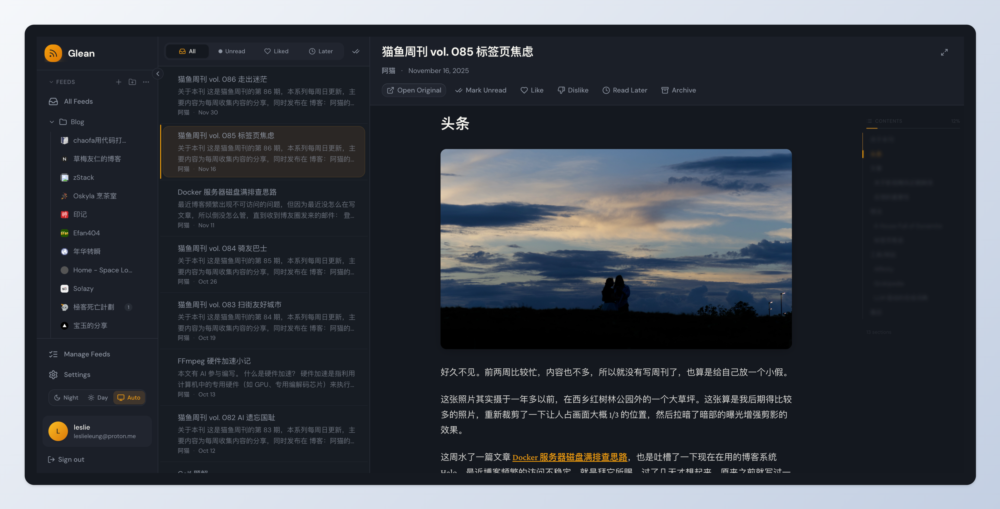

# Glean 拾灵

**[English](./README.md)** | **[中文](./README.zh-CN.md)**

A self-hosted RSS reader and personal knowledge management tool.

> **Glean** (拾灵) helps information-heavy consumers efficiently manage their reading through intelligent RSS aggregation.



## Features

### Core Features
- 📰 **RSS Subscription** - Subscribe and organize RSS/Atom feeds with OPML import/export
- 📚 **Smart Reading** - Clean reading experience with content filtering
- 🔖 **Read Later** - Save articles for later reading with auto-cleanup
- 📁 **Folders & Tags** - Multi-level folders and tags for organization
- ⭐ **Bookmarks** - Save articles from feeds or external URLs
- 🔧 **Background Sync** - Automatic feed updates every 15 minutes
- 🔒 **Self-hosted** - Full data ownership with Docker deployment
- 🎨 **Modern UI** - Beautiful, responsive warm dark theme interface
- 👨‍💼 **Admin Dashboard** - User management and system monitoring

### Planned Features (WIP)
- 🧠 **Smart Recommendations** - AI-powered preference learning and article scoring
- ⚙️ **Rule Engine** - Automated processing with Jinja2-style conditions
- 🤖 **AI Features** - Summary generation, auto-tagging, keyword extraction (BYOK)
- 📄 **Full Content Fetch** - Fetch complete article content for RSS summaries
- 🔌 **Chrome Extension** - One-click bookmarking from browser
- 📱 **Mobile PWA** - Progressive Web App for mobile devices

## Quick Start

### One-Command Deployment

```bash
# Download and start Glean
curl -fsSL https://raw.githubusercontent.com/LesliLeung/glean/main/docker-compose.yml -o docker-compose.yml
docker compose up -d

# Access at http://localhost
```

That's it! Open http://localhost to start using Glean.

### With Admin Dashboard

For additional admin features (user management, statistics):

```bash
# Download full deployment config
curl -fsSL https://raw.githubusercontent.com/LesliLeung/glean/main/docker-compose.full.yml -o docker-compose.yml

# Create admin account on first startup
CREATE_ADMIN=true docker compose up -d

# Check logs for admin credentials (save them!)
docker compose logs backend | grep -A5 "Admin Account Created"

# Access:
# - Web App: http://localhost
# - Admin Dashboard: http://localhost:3001
```

### Create Admin Account Manually

```bash
# Generate random password
docker exec -it glean-backend /app/scripts/create-admin-docker.sh

# Or specify credentials
docker exec -it glean-backend /app/scripts/create-admin-docker.sh myusername MySecurePass123!
```

## Configuration

Copy `.env.example` to `.env` and customize:

```bash
curl -fsSL https://raw.githubusercontent.com/LesliLeung/glean/main/.env.example -o .env
```

Key settings:

| Variable            | Description          | Default                   |
| ------------------- | -------------------- | ------------------------- |
| `SECRET_KEY`        | JWT signing key      | **Change in production!** |
| `POSTGRES_PASSWORD` | Database password    | `glean`                   |
| `WEB_PORT`          | Web interface port   | `80`                      |
| `ADMIN_PORT`        | Admin dashboard port | `3001`                    |

## Docker Images

Pre-built images are available on GitHub Container Registry:

- `ghcr.io/leslieleung/glean-backend:latest` - API server & worker
- `ghcr.io/leslieleung/glean-web:latest` - Web frontend
- `ghcr.io/leslieleung/glean-admin:latest` - Admin dashboard

Supported architectures: `linux/amd64`, `linux/arm64`

## Deployment Options

| Deployment | Description             | Command                                           |
| ---------- | ----------------------- | ------------------------------------------------- |
| **Lite**   | Web app only (no admin) | `docker compose up -d`                            |
| **Full**   | Web + Admin dashboard   | `docker compose -f docker-compose.full.yml up -d` |

## Tech Stack

**Backend:**
- Python 3.11+ / FastAPI / SQLAlchemy 2.0
- PostgreSQL / Redis / arq (task queue)

**Frontend:**
- React 18 / TypeScript / Vite
- Tailwind CSS / Zustand / TanStack Query

## Development

See **[DEVELOPMENT.md](./DEVELOPMENT.md)** for complete development setup instructions.

Quick start:

```bash
# Clone and setup
git clone https://github.com/LesliLeung/glean.git
cd glean
npm install

# Start infrastructure
make up

# Initialize database (first time only)
make db-upgrade

# Start all services
make dev-all

# Access:
# - Web: http://localhost:3000
# - Admin: http://localhost:3001
# - API Docs: http://localhost:8000/api/docs
```

## Roadmap

| Phase                     | Status    | Features                                                       |
| ------------------------- | --------- | -------------------------------------------------------------- |
| **Phase 1: MVP**          | ✅ Done    | User system, RSS subscription, reader, admin dashboard         |
| **Phase 2: Organization** | ✅ Done    | Bookmarks, folders, tags, read later                           |
| **Phase 3: Preferences**  | 🚧 WIP     | Embedding pipeline, preference learning, smart recommendations |
| **Phase 4: Rules**        | 📋 Planned | Rule engine, Jinja2 conditions, automated actions              |
| **Phase 5: AI**           | 📋 Planned | AI summaries, auto-tagging, keyword extraction, BYOK support   |
| **Phase 6: Extensions**   | 📋 Planned | Chrome extension, PWA, web snapshots                           |

See **[Product Requirements](./docs/glean-prd-v1.2.md)** for detailed feature specifications.

## Documentation

- **[Development Guide](./DEVELOPMENT.md)** - Set up your development environment
- **[Deployment Guide](./deploy/README.md)** - Production deployment details

## Contributing

Contributions are welcome! Please read our [Development Guide](./DEVELOPMENT.md) first.

1. Fork the repository
2. Create a feature branch
3. Make your changes
4. Run tests and linting
5. Submit a Pull Request

## License

This project is licensed under the **AGPL-3.0 License** - see the [LICENSE](LICENSE) file for details.
